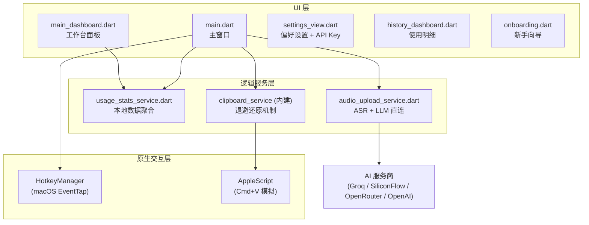
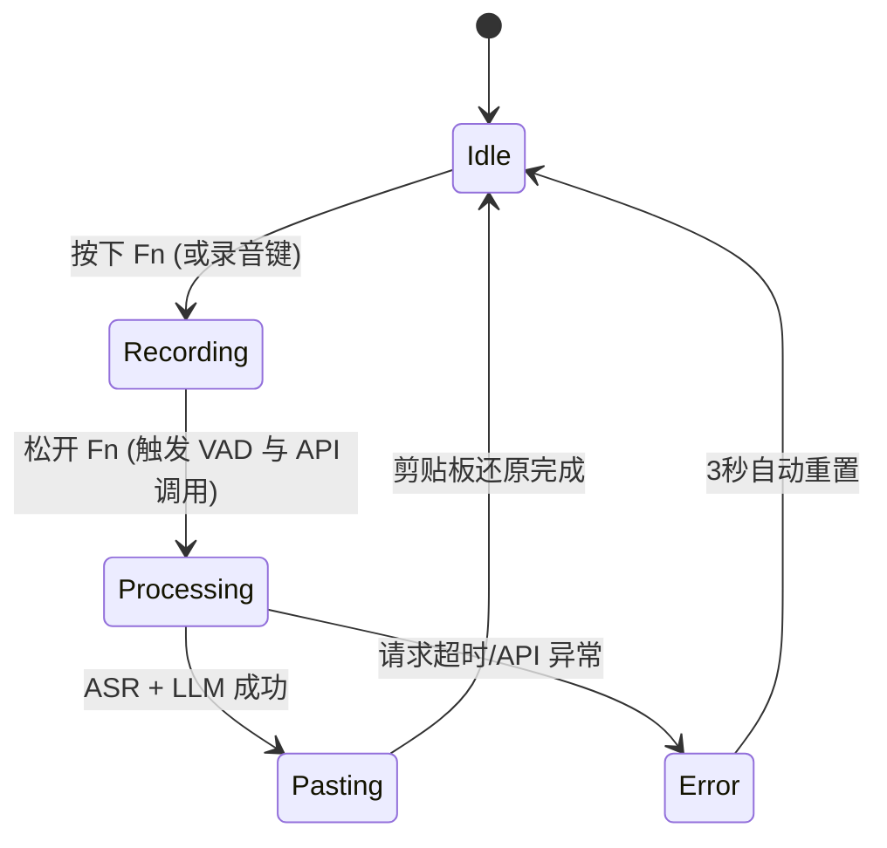
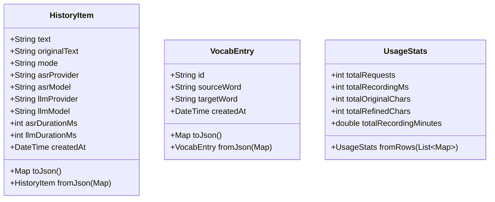

# 桌面客户端技术架构 (Flutter)

> 描述 Flutter macOS 客户端的分层架构、AI 调用流程、状态机模型与纯本地纯逻辑测试策略。

## 目录
- [1. 概述](#1-概述)
- [2. 架构设计](#2-架构设计)
- [3. AudioUploadService 详解](#3-audiouploadservice-详解)
- [4. 数据结构](#4-数据结构)
- [5. 单元测试](#5-单元测试)
- [6. 注意事项](#6-注意事项)

---

## 1. 概述
- **背景**: 构建一个无缝融入系统流程（按下录音，松开长文本上屏）的极简客户端。
- **核心价值**: 提供毫秒级的全局热键响应与稳定的系统剪贴板注入能力。
- **架构特点**: 纯客户端架构，AI 服务直连，无后端依赖。用户在设置面板输入 API Key，客户端直接调用 Groq / SiliconFlow / OpenRouter / OpenAI。

---

## 2. 架构设计

### 2.1 技术栈

| 组件 | 技术 | 说明 |
|------|------|------|
| 核心框架 | Flutter 3.32 | 纯 macOS 桌面端应用 |
| 状态管理 | `setState` + `ValueNotifier` | 轻量级状态管理 |
| 网络通信 | `Dio` | FormData 音频上传、JSON 请求、超时控制 |
| 本地存储 | `SharedPreferences` | 用户偏好 / API Key / 历史记录 |
| 环境变量 | `flutter_dotenv` | 从 `.env` 文件加载备用 API Key |
| 国际化 | `slang_flutter` | 强类型安全的 6 种 UI 语言支持 |
| 桌面原生 | `hotkey_manager` | 全局 Fn 键底层监听 |

### 2.2 核心模块关系



### 2.3 核心状态机设计

录音的主流程被严格抽象为一个有限状态机（FSM），防止异步并发导致的时序混乱：



---

## 3. AudioUploadService 详解

`lib/audio_upload_service.dart` 是客户端 AI 调用的核心，运行在主窗口，处理子窗口通过 IPC 发来的音频文件。

### 3.1 内部类型

#### `_PhaseResult`

封装 ASR 或 LLM 单阶段的执行结果：

```dart
class _PhaseResult {
  final String text;      // 输出文本
  final String provider;  // 服务商名称（如 "Groq"、"SiliconFlow"）
  final String model;     // 模型名称（如 "whisper-large-v3"）
  final int durationMs;   // 耗时毫秒
}
```

#### `_ApiKeyService`

负责 API Key 的解析，规则：**SharedPreferences 优先，其次 `.env` 文件**。

```dart
class _ApiKeyService {
  String? get groqKey        => _get('groq_api_key',        'GROQ_API_KEY');
  String? get openRouterKey  => _get('openrouter_api_key',  'OPENROUTER_API_KEY');
  String? get siliconFlowKey => _get('siliconflow_api_key', 'SILICONFLOW_API_KEY');
  String? get openAiKey      => _get('openai_api_key',      'OPENAI_API_KEY');
  // prefs 中有值则用 prefs，否则读 dotenv
}
```

#### `_Prompts`

静态类，提供中英文双套 Prompt 模板，分为润色（refine）和翻译（translate）两种模式，各含 CN/US 两套。

### 3.2 ASR 流程（`_transcribeAudio`）

| 节点 | 端点 | 模型 | Key |
|------|------|------|-----|
| CN | `https://api.siliconflow.cn/v1/audio/transcriptions` | `FunAudioLLM/SenseVoiceSmall` | `siliconFlowKey` |
| US | `https://api.groq.com/openai/v1/audio/transcriptions` | `whisper-large-v3` | `groqKey` |
| 灾备 | `https://api.openai.com/v1/audio/transcriptions` | `whisper-1` | `openAiKey` |

SenseVoice 的结果会经过 Emoji 过滤（`_removeEmojis`）后再进入 LLM 阶段。

### 3.3 LLM 流程（`_runLLM`）

| 节点 | 端点 | 模型 | Key |
|------|------|------|-----|
| CN | `https://api.siliconflow.cn/v1/chat/completions` | `Qwen/Qwen2.5-32B-Instruct` | `siliconFlowKey` |
| US | `https://openrouter.ai/api/v1/chat/completions` | `openai/gpt-4o-mini` | `openRouterKey` |
| 灾备 | `https://api.openai.com/v1/chat/completions` | `gpt-4o-mini` | `openAiKey` |

关键参数：`temperature: 0.1`（追求确定性输出）。LLM 完全失败时降级为直接使用 ASR 原始文本。

### 3.4 `handleUpload` 完整流程

```
子窗口 IPC upload_audio
    → 读取 SharedPreferences (targetLang, serverRegion)
    → _ApiKeyService 解析 Key
    → status_update: uploading
    → _transcribeAudio() → ASR 原始文本
    → status_update: processing
    → _runLLM() → 精炼文本
    → HistoryStorage.saveHistory() 保存到 SharedPreferences
    → Clipboard.setData() 写入剪贴板
    → paste_to_frontmost (AppDelegate AppleScript)
    → play_success_sound
    → 延迟 1000ms → 恢复旧剪贴板
    → _onStatsUpdated() 刷新统计
    → status_update: done
```

### 3.5 统计服务（UsageStatsService）

`lib/usage_stats_service.dart` 从本地 SharedPreferences 的历史记录中聚合统计数据（请求次数、录音时长、字符数等），完全无需网络请求。数据按时间段（日/周/月/全部）过滤。

---

## 4. 数据结构

客户端核心实体均有严格的强类型断言与序列化能力。以下为核心 Dart 模型的类图：



---

## 5. 单元测试

本项目采用**纯逻辑抽离测试**，脱离 Widget 树，在 Dart VM 中高速执行，102 个用例均在 1 秒内完成。

```bash
cd app_demo && flutter test --reporter expanded
```

| 测试文件 | 用例数 | 覆盖点 |
|---------|-------|--------|
| `usage_stats_test.dart` | 14 | UsageStats 模型解析、多行聚合、null 字段容错、时间换算精度 |
| `vad_detection_test.dart` | 17 | 振幅归一化边界、语音帧判定、VAD 三阈值组合 |
| `clipboard_protection_test.dart` | 16 | 空结果静默保护、1000ms 时序约束、API 响应 fallback 链 |
| `main_dashboard_test.dart` | 13 | 数据聚合保护、时间单位转换、KPI 格式化 |
| `onboarding_flow_test.dart` | 10 | 步骤结构、权限检查逻辑、完成标志验证 |
| `history_storage_test.dart` | 9 | JSON 序列化、列表增删操作、节省时间计算 |
| `vocabulary_storage_test.dart` | 9 | VocabEntry 结构体验证 |
| `settings_view_test.dart` | 8 | 19 种语言 key 映射完整性、6 个 i18n 文件一致性 |
| `widget_test.dart` | 6 | 版本号格式、语言映射覆盖率 |

---

## 6. 注意事项

> [!WARNING]
> **剪贴板并发极易污染**
> Flutter `Clipboard.setData` 与 AppleScript 执行并非纯同步。如果修改了 `clipboard_protection_test.dart` 里的 `await Future.delayed` 的毫秒常量，务必全链路真机重测！

> [!WARNING]
> **全局快捷键抢占**
> `hotkey_manager` 利用 C++ 拦截低级事件机制，如果在调试阶段热重载 (Hot Reload) 导致监听器没正确 `unregister`，会出现无论按什么键电脑都没反应。此时需 Command+Q 强退。

> [!WARNING]
> **API Key 缺失时的行为**
> `_ApiKeyService` 对应的 key 为 `null` 时，ASR/LLM 方法会抛出异常并进入 fallback 链。若所有 key 均缺失，`handleUpload` 会捕获错误并通过 `status_update {state: error}` 通知子窗口显示错误提示。引导用户前往设置面板填写 API Key。

