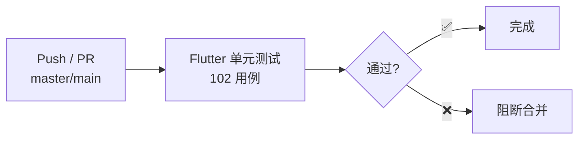
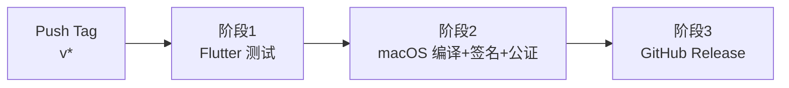

# 部署与运维手册 (Deployment Guide)

> 本应用为纯客户端架构，无后端服务。部署流程分为两步：配置 API Key，然后构建/运行应用。

## 目录
- [1. 概述](#1-概述)
- [2. 本地开发环境搭建](#2-本地开发环境搭建)
- [3. API Key 配置](#3-api-key-配置)
- [4. CI/CD 流程](#4-cicd-流程)
- [5. 生产发布](#5-生产发布)
- [6. macOS 签名与公证](#6-macos-签名与公证)
- [7. 回滚策略](#7-回滚策略)
- [8. 注意事项](#8-注意事项)

---

## 1. 概述

- **架构**: 纯 Flutter macOS 桌面应用，所有 AI 调用（ASR + LLM）由客户端直接发起，无后端服务器，无数据库。
- **目标**: 明确本地开发、API Key 配置、构建签名及发布流程。

---

## 2. 本地开发环境搭建

### 2.1 前提条件

| 工具 | 版本 | 安装 |
|------|------|------|
| Flutter | 3.32+ | [flutter.dev](https://flutter.dev/docs/get-started/install) |
| Dart | 3.10+ | 随 Flutter 安装 |
| Xcode | 15+ | macOS App Store |
| macOS | 10.15+ | — |

### 2.2 启动步骤

```bash
# 1. 克隆项目
git clone <repo-url>
cd audio_translater_input/app_demo

# 2. 配置 API Key（二选一）
#    方式 A：创建 .env 文件（开发推荐）
cp .env.example .env
# 编辑 .env，填入以下内容：
#   GROQ_API_KEY=gsk_xxxxxxxxxxxx
#   OPENROUTER_API_KEY=sk-or-xxxxxxxxxxxx
#   SILICONFLOW_API_KEY=sk-xxxxxxxxxxxx
#   OPENAI_API_KEY=sk-xxxxxxxxxxxx（可选，灾备）

#    方式 B：启动后在 设置 → API Keys 面板中填写（无需 .env 文件）

# 3. 安装 Flutter 依赖
flutter pub get

# 4. 运行应用（macOS）
flutter run -d macos
```

---

## 3. API Key 配置

本应用直接调用以下 AI 服务商 API，用户需自行申请 Key：

| 服务商 | 用途 | 节点 | 申请地址 |
|--------|------|------|---------|
| Groq | ASR（whisper-large-v3） | US | [console.groq.com](https://console.groq.com) |
| OpenRouter | LLM（gpt-4o-mini） | US | [openrouter.ai/keys](https://openrouter.ai/keys) |
| 硅基流动（SiliconFlow） | ASR + LLM | CN | [cloud.siliconflow.cn](https://cloud.siliconflow.cn) |
| OpenAI | 灾备 ASR + LLM | 全球 | [platform.openai.com](https://platform.openai.com) |

**配置优先级**: 设置面板（SharedPreferences）> `.env` 文件。详见 [环境变量文档](./Environment_Variables.md)。

**最小配置**:
- US 节点用户：需要 `GROQ_API_KEY` + `OPENROUTER_API_KEY`
- CN 节点用户：需要 `SILICONFLOW_API_KEY`

---

## 4. CI/CD 流程

### 4.1 日常开发（`test.yml`）



**触发条件**: 每次 push 到 `master`/`main` 或 PR

| Job | Runner | 内容 |
|-----|--------|------|
| `flutter-tests` | `macos-latest` | `flutter test --reporter expanded` |

### 4.2 版本发布（`release.yml`）



**触发条件**: 推送 `v*` 格式的 Git Tag（如 `v1.0.0`）

| 阶段 | Job | 内容 |
|------|-----|------|
| 1 | `test` | Flutter 单元测试（102 用例） |
| 2 | `build` | `flutter build macos --release` → 代码签名 → Apple 公证 → ZIP 打包 |
| 3 | `release` | 创建 GitHub Release + 上传签名 ZIP |

---

## 5. 生产发布

### 5.1 发布新版本

```bash
# 1. 更新版本号
# 编辑 app_demo/pubspec.yaml 中的 version 字段（如 1.2.0+3）

# 2. 提交更改
git add app_demo/pubspec.yaml
git commit -m "chore: bump version to 1.2.0"

# 3. 推送 Tag 触发自动化流水线
git tag v1.2.0
git push origin v1.2.0
# → GitHub Actions 自动: 测试 → 编译签名公证 → 创建 GitHub Release
```

### 5.2 手动构建（无 CI）

```bash
cd app_demo

# Debug 构建（本地测试）
flutter run -d macos

# Release 构建
flutter build macos --release
# 产物位于: build/macos/Build/Products/Release/Audio Translate Input.app
```

---

## 6. macOS 签名与公证

生产发布需要 Apple Developer 账号进行代码签名和公证，否则用户运行时会被 Gatekeeper 拦截。

### 6.1 所需证书和账号

| 项目 | 说明 |
|------|------|
| Developer ID Application 证书 | 用于代码签名，导出为 `.p12` 文件 |
| Apple ID | 用于提交 Apple 公证（Notarization） |
| 应用专用密码 | Apple ID 后台生成，用于 `notarytool` |
| Team ID | Apple Developer 账号的 Team ID |

### 6.2 GitHub Actions Secrets（需配置）

在 GitHub → Settings → Secrets and variables → Actions 中配置：

| Secret 名 | 说明 |
|-----------|------|
| `MACOS_CERTIFICATE` | Developer ID 证书 Base64 编码（`base64 -i cert.p12`） |
| `MACOS_CERTIFICATE_PWD` | 证书密码 |
| `KEYCHAIN_PASSWORD` | CI 临时 Keychain 密码（任意字符串） |
| `NOTARIZATION_APPLE_ID` | Apple ID 邮箱 |
| `NOTARIZATION_PASSWORD` | 应用专用密码 |
| `NOTARIZATION_TEAM_ID` | Developer Team ID |

### 6.3 本地手动签名（可选）

```bash
# 签名
codesign --force --deep --sign "Developer ID Application: Your Name (TEAMID)" \
  "build/macos/Build/Products/Release/Audio Translate Input.app"

# 打包
ditto -c -k --keepParent \
  "build/macos/Build/Products/Release/Audio Translate Input.app" \
  "Audio Translate Input.zip"

# 公证提交
xcrun notarytool submit "Audio Translate Input.zip" \
  --apple-id "your@email.com" \
  --password "app-specific-password" \
  --team-id "TEAMID" \
  --wait

# 钉入公证票据
xcrun stapler staple "build/macos/Build/Products/Release/Audio Translate Input.app"
```

---

## 7. 回滚策略

| 组件 | 回滚方式 |
|------|---------|
| 客户端应用 | 在 GitHub Release 页面下载旧版本 ZIP 覆盖 |
| API Key 配置 | 在设置面板直接修改，或替换 `.env` 文件重启 |

---

## 8. 注意事项

> [!WARNING]
> **API Key 安全**
> `.env` 文件已在 `.gitignore` 中排除，切勿将其提交至代码仓库。设置面板中的 Key 存储于 macOS App 沙箱内的 SharedPreferences，仅本机可读。

> [!WARNING]
> **公证失败排查**
> 若 `notarytool` 返回错误，先检查：1) 证书是否已加入 Keychain；2) 应用专用密码是否正确；3) 是否启用了两步验证。可通过 `xcrun notarytool log <submission-id>` 查看详细错误报告。

> [!TIP]
> **首次运行（未签名构建）**
> 本地 `flutter run` 产生的 Debug 包无需签名，但 macOS 可能弹出"无法验证开发者"提示。在 系统设置 → 隐私与安全性 中点击"仍要打开"即可。

