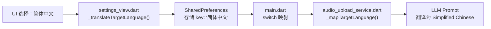

# 多语言与国际化方案 (Multilingual & i18n)

> 阐述两套各自独立的翻译体系：UI 元素的静态词条、及调用大模型的实时音频翻译靶向指引。

## 目录
- [1. 概述](#1-概述)
- [2. 两层多语言体系](#2-两层多语言体系)
- [3. UI 界面语言（slang 框架）](#3-ui-界面语言slang-框架)
  - [3.4 各文件包含的模块](#34-各文件包含的模块)
  - [3.5 修改后重新生成](#35-修改后重新生成)
- [4. 翻译目标语言（19 种）](#4-翻译目标语言19-种)
- [5. 一致性保障 (Tests)](#5-一致性保障-tests)

---

## 1. 概述
- **背景**: 面向国际市场，必须支持多语言界面和目标语言扩展。
- **目标**: 将繁重的客户端渲染与动态服务完全剥离。

---

## 2. 两层多语言体系

本项目的多语言分为两个独立维度：

| 维度 | 说明 | 数量 |
|------|------|------|
| **UI 界面语言** | App 菜单、按钮、提示文字的显示语言 | 6 种 |
| **翻译目标语言** | ASR→LLM 翻译管道的输出语言 | 19 种 |

---

## 3. UI 界面语言（slang 框架）

### 3.1 技术栈
- **框架**: `slang` + `slang_flutter`（Dart 原生 i18n 方案）
- **生成器**: `slang_build_runner`（自动生成强类型代码）

### 3.2 支持的 6 种 UI 语言

| 语言 | 文件 | Locale |
|------|------|--------|
| English | `strings.i18n.json` | `en` (默认) |
| 简体中文 | `strings_zh-Hans.i18n.json` | `zh-Hans` |
| 繁体中文 | `strings_zh-Hant.i18n.json` | `zh-Hant` |
| 日本語 | `strings_ja.i18n.json` | `ja` |
| Deutsch | `strings_de.i18n.json` | `de` |
| Español | `strings_es.i18n.json` | `es` |

### 3.3 文件结构
```
app_demo/lib/i18n/
├── strings.i18n.json          ← 英语（默认/基准）
├── strings_zh-Hans.i18n.json  ← 简体中文
├── strings_zh-Hant.i18n.json  ← 繁体中文
├── strings_ja.i18n.json       ← 日语
├── strings_de.i18n.json       ← 德语
├── strings_es.i18n.json       ← 西班牙语
├── strings.g.dart             ← 自动生成的类型安全代码
└── strings_*.g.dart           ← 各语言的生成文件
```

### 3.4 各文件包含的模块

每个 i18n JSON 文件均包含以下顶层命名空间：

| 命名空间 | 内容 |
|---------|------|
| `status` | 录音条状态文字（空闲、处理中、粘贴成功等） |
| `common` | 通用时间格式（分秒、小时分钟） |
| `locales` | 6 种 UI 语言的显示名 |
| `settings` | 设置面板各选项文字（UI/系统/热键/翻译） |
| `dashboard` | 主工作台文字（侧边栏导航、统计标签等） |
| `history` | 历史记录视图文字 |
| `onboarding` | 新手向导步骤文字 |
| `vocab` | 个人词典视图文字 |

> 本应用无账号体系——`auth`（登录/注册）和 `paywall`（订阅/计费）命名空间已从所有 i18n 文件中移除。

### 3.5 修改后重新生成

编辑任意 `*.i18n.json` 源文件后，运行以下命令重新生成强类型 Dart 代码：

```bash
cd app_demo
dart run slang
```

生成文件（`strings.g.dart`、`strings_*.g.dart`）由工具维护，不应手动编辑。

### 3.6 使用方式
```dart
// 引用翻译文本
final t = Translations.of(context);
Text(t.status.idle);  // "Press Fn to Record" 或 "按下 Fn 开始录音"

// 切换语言
LocaleSettings.setLocale(AppLocale.zhHans);
```

---

## 4. 翻译目标语言（19 种）

### 4.1 完整语言列表

| UI 显示名 | HTTP Header 值 | 分组 |
|-----------|---------------|------|
| 英语 | `English` | 欧美 |
| 简体中文 | `Simplified Chinese` | 东亚 |
| 繁体中文 | `Traditional Chinese` | 东亚 |
| 日语 | `Japanese` | 东亚 |
| 韩语 | `Korean` | 东亚 |
| 法语 | `French` | 欧美 |
| 德语 | `German` | 欧美 |
| 俄语 | `Russian` | 欧美 |
| 西班牙语 | `Spanish` | 欧美 |
| 意大利语 | `Italian` | 欧美 |
| 葡萄牙语 | `Portuguese` | 欧美 |
| 荷兰语 | `Dutch` | 欧美 |
| 阿拉伯语 | `Arabic` | 中东 |
| 土耳其语 | `Turkish` | 中东 |
| 瑞典语 | `Swedish` | 欧美 |
| 印地语 | `Hindi` | 南亚 |
| 泰语 | `Thai` | 东南亚 |
| 越南语 | `Vietnamese` | 东南亚 |
| 印尼语 | `Indonesian` | 东南亚 |

### 4.2 语言映射流程



---

## 5. 一致性保障 (Tests)

每个 i18n JSON 文件中的 `settings.target_languages` 节点必须包含完整的 19 个语言 key：

```
en, zh_Hans, zh_Hant, ja, ko,
fr, de, ru, es, it, pt, nl, ar, tr, sv,
hi, th, vi, id
```

> 这一一致性通过 `settings_view_test.dart` 中的自动化测试用例保障，任何语言 key 缺失都会被 CI 拦截。

